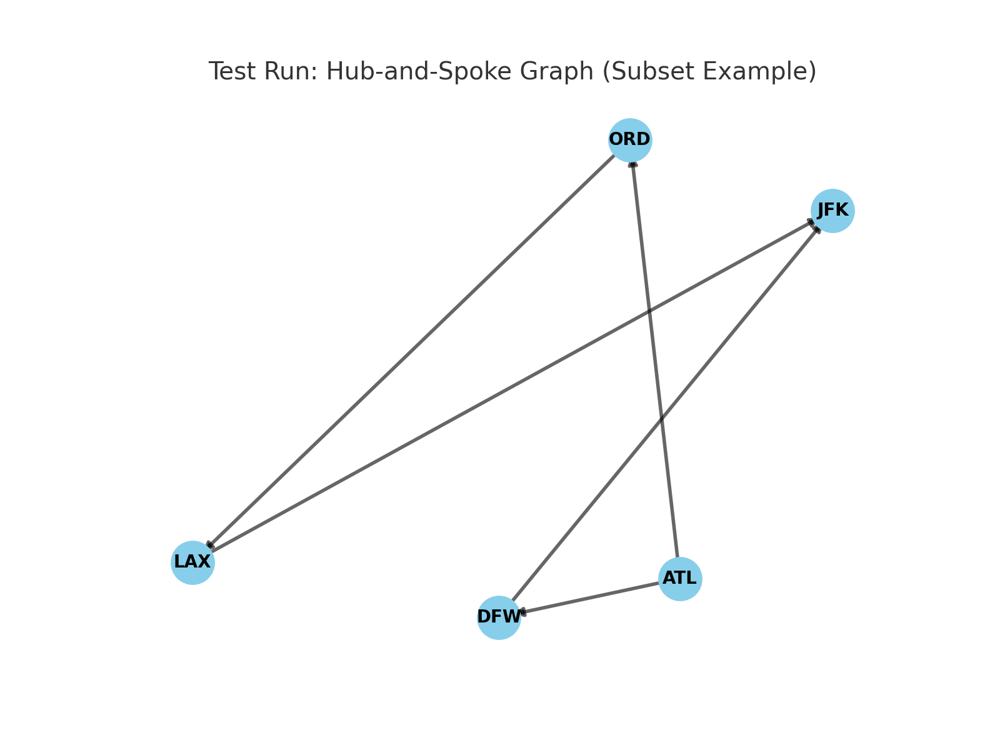
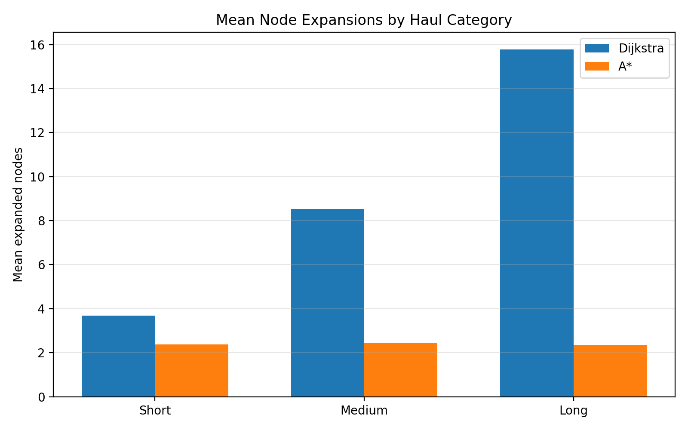

# Airline Network Pathfinding: Dijkstra vs. A*

[](https://github.com/AT-365/airline-network-pathfinding/actions/workflows/tests.yml)

## Project summary

This project compares Dijkstra's algorithm and A* search on a directed U.S. airline network. Airports are vertices, historical direct routes are edges, and Haversine distance in kilometers supplies both edge weights and A*'s admissible heuristic. I implemented both algorithms in Python, validated their shortest-path costs across 120 origin-destination pairs, and measured runtime and search effort over 200 runs per pair.

The experiment asks a practical question: **Can heuristic guidance reduce the amount of graph search without sacrificing the optimal route cost?**

## Code first

- [Dijkstra implementation](src/algorithms/dijkstra.py)
- [A* implementation](src/algorithms/astar.py)
- [Haversine heuristic](src/algorithms/heuristics.py)
- [Graph loader](src/graph/loader.py)
- [Complete experiment runner](tools/run_final_experiment.py)
- [Automated real-network tests](tests/test_real_graph.py)
- [Interactive route runner](bench/runner.py)

## Verified results

| Measure | Result |
|---|---:|
| Airport nodes | 20 |
| Directed routes | 293 |
| Origin-destination pairs | 120 |
| Timing runs per pair, per algorithm | 200 |
| Shortest-path cost agreement | 100% |
| Mean nodes expanded by Dijkstra | 9.325 |
| Mean nodes expanded by A* | 2.392 |
| Mean expansion reduction | 74.35% |
| Pairs where A* expanded fewer nodes | 85.0% |
| Pairs where A* was faster by mean runtime | 56.7% |
| Mean Dijkstra/A* runtime ratio | 2.440x |

The most stable result is the reduction in node expansions. Runtime values are extremely small on a 20-node graph and can vary by machine, operating conditions, and timing noise. The submitted experiment showed the clearest A* runtime advantage on long-haul pairs.





## What I built

- Directed adjacency-list model for historical airport-route data
- Dijkstra search using a binary min-heap priority queue
- A* search using `f(n) = g(n) + h(n)` and a Haversine heuristic
- Path reconstruction and route-cost validation
- Instrumentation for node expansions, relaxations, heap pushes, hops, and runtime
- Stratified evaluation with 40 short-, 40 medium-, and 40 long-haul pairs
- Automated tests on toy graphs and all 120 configured real-network pairs
- Reproducible CSV summaries and Matplotlib figures

## Tools and technologies

| Tool | Use in the project |
|---|---|
| Python 3.13 | Algorithm implementation and experiment automation |
| `heapq` | Binary min-heap operations for A* |
| Custom priority-queue helper | Dijkstra queue operations |
| Haversine formula | Geographic edge weights and A* heuristic |
| Matplotlib | Benchmark charts and network figures |
| pandas | Result processing support |
| NetworkX | Graph visualization support |
| pytest | Correctness and regression tests |
| CSV and pathlib | Data loading, outputs, and reproducible file handling |
| GitHub Actions | Automated test execution on every repository update |

## Experiment outputs

The published files below are the exact May 7 outputs that match the final report and presentation:

- [Overall summary](results/final_200/final_results_summary.csv)
- [Results by haul category](results/final_200/final_results_by_haul.csv)
- [Merged pair-level comparison](results/final_200/final_results_merged.csv)
- [All repeated-run results](results/final_200/final_results_all.csv)
- [Annotated OD-pair workbook](data/od_pairs_annotated.xlsx)
- [All charts](results/final_200/figures/)

## Repository map

| Path | Purpose |
|---|---|
| `src/algorithms/` | Dijkstra, A*, heuristic, and path reconstruction |
| `src/graph/` | CSV graph loader and graph visualization |
| `src/utils/` | Haversine distance and priority-queue helpers |
| `tools/` | Complete benchmark, parsing, ingestion, and comparison tools |
| `bench/` | Command-line runner for selected routes |
| `tests/` | Toy-graph, real-route, and all-pair validation |
| `data/` | Airport nodes, directed edges, OD pairs, and annotated pair workbook |
| `results/final_200/` | Report-matching CSV outputs and figures |
| `portfolio/` | Final graded report and artifact documentation |

## Run the project

```bash
git clone https://github.com/AT-365/airline-network-pathfinding.git
cd airline-network-pathfinding
python -m venv .venv
source .venv/bin/activate  # Windows: .venv\Scripts\activate
python -m pip install -r requirements.txt
python -m pytest -q
```

Reproduce the complete benchmark in a separate output folder:

```bash
python tools/run_final_experiment.py --runs 200 --outdir results/reproduced_200
```

Run one route interactively:

```bash
python bench/runner.py --nodes data/nodes.csv --edges data/edges.csv --algo astar --od ATL-SEA
```

## Final artifacts

- [Final project report](portfolio/final_report.pdf)
- Narrated final presentation: attached to the verified `v1.0.0` GitHub release

The report and presentation describe the same 20-airport experiment and results. The presentation's phrase “100% path agreement” refers specifically to the report's verified **100% shortest-path cost agreement**.

## Data note

The network is a static experimental sample derived from historical OpenFlights airport and route records. It is not a current airline schedule, and the results should not be interpreted as live route-planning advice.

## Author

Autenia Murray  
M.S. Computer Science candidate, Data & Knowledge Systems
