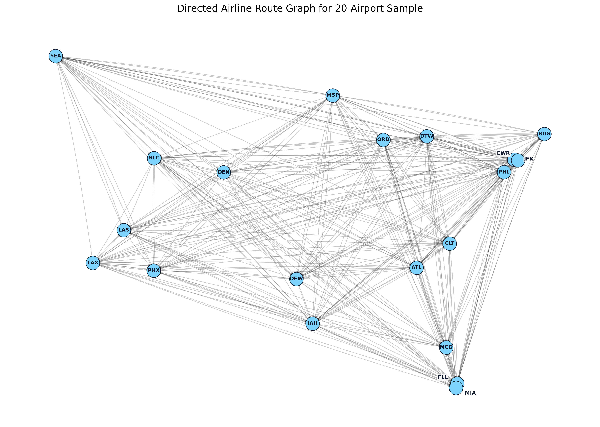

# Airline Network Pathfinding: Dijkstra vs. A*

[](https://github.com/AT-365/airline-network-pathfinding/actions/workflows/tests.yml)
[](https://www.python.org/)
[](LICENSE)

A reproducible Python experiment comparing Dijkstra's algorithm and A* search on a directed U.S. airline network. The project models 20 major airports as vertices, historical direct routes as weighted edges, and geographic distance as an admissible A* heuristic.

> **Research question:** Can heuristic guidance reduce graph-search work without sacrificing optimal route cost?

> **Answer:** Yes. Across 120 origin-destination pairs, A* matched Dijkstra's optimal cost every time while expanding 74.35% fewer nodes on average.



## Why This Project Matters

This project demonstrates the ability to turn algorithm theory into a tested, reproducible experiment:

- implemented Dijkstra and A* from scratch rather than calling library solvers
- designed an admissible Haversine heuristic for geographic search
- separated deterministic correctness and search-efficiency evidence from machine-sensitive timing
- evaluated a stratified sample of short-, medium-, and long-haul routes
- automated testing, benchmarking, result aggregation, and chart generation
- communicated conclusions and limitations through code, a written report, and a narrated presentation

## Verified Results

| Measure | Result |
|---|---:|
| Airport nodes | 20 |
| Directed routes | 293 |
| Origin-destination pairs | 120 |
| Timing runs per pair, per algorithm | 200 |
| Shortest-path cost agreement | 100% |
| Mean nodes expanded by Dijkstra | 9.325 |
| Mean nodes expanded by A* | 2.392 |
| Mean expansion reduction | 74.35% |
| Pairs where A* expanded fewer nodes | 85.0% |
| Pairs where A* was faster by mean runtime | 56.7% |
| Mean Dijkstra/A* runtime ratio | 2.440x |

The strongest result is the **74.35% reduction in mean node expansions**. Runtime measurements on a 20-node graph are close to Python's timing-noise floor and vary by machine, so they should be interpreted as secondary evidence rather than a universal speed claim.

## Experiment Design

The graph contains 20 U.S. airports and 293 directed historical routes. Edge weights are Haversine distances in kilometers. The 120 test pairs are divided equally into short-, medium-, and long-haul groups by great-circle distance.

For each pair, the experiment:

1. runs Dijkstra and A* once as a warmup;
2. times each algorithm 200 times;
3. checks that both algorithms return the same optimal cost;
4. records path length, node expansions, relaxations, heap pushes, and runtime; and
5. aggregates overall and haul-category results into CSV files and charts.

A* uses straight-line Haversine distance to the destination as `h(n)`. Because each route edge is weighted by the same geographic-distance model, the heuristic does not overestimate the remaining route cost. This preserves optimality while directing the search toward the destination.

## What I Built

- directed adjacency-list graph loader for airport and route CSV data
- binary-min-heap Dijkstra implementation with path reconstruction
- A* implementation using `f(n) = g(n) + h(n)`
- instrumentation for expansions, relaxations, heap pushes, hops, and runtime
- reproducible experiment runner with equal-third distance stratification
- seven pytest checks, including one that validates all 120 configured pairs
- result-processing utilities for current and legacy benchmark formats
- Matplotlib benchmark charts and a NetworkX network visualization
- GitHub Actions workflow that runs the test suite on pushes and pull requests

## Portfolio Artifacts

- [Final report](portfolio/final_report.pdf) — methods, results, interpretation, and limitations
- [Presentation slides](portfolio/presentation_slides.pdf) — browser-friendly 12-slide version
- Narrated PowerPoint — approximately 13 minutes; intended for the `v1.0.0` GitHub release
- [Overall result summary](results/final_200/final_results_summary.csv)
- [Results by haul category](results/final_200/final_results_by_haul.csv)
- [Pair-level comparison](results/final_200/final_results_merged.csv)
- [Complete repeated-run results](results/final_200/final_results_all.csv)
- [Annotated OD-pair workbook](data/od_pairs_annotated.xlsx)

The presentation says “100% path agreement” as a concise slide label. The precisely validated claim is **100% shortest-path cost agreement**; equal-cost routes may still have different node sequences.

## Quick Start

```bash
git clone https://github.com/AT-365/airline-network-pathfinding.git
cd airline-network-pathfinding
python -m venv .venv
source .venv/bin/activate  # Windows: .venv\Scripts\activate
python -m pip install -r requirements.txt
```

Run the tests:

```bash
python -m pytest -q
```

Reproduce the full experiment in a new output folder:

```bash
python tools/run_final_experiment.py --runs 200 --outdir results/reproduced_200
```

Run a single route from the command line:

```bash
python bench/runner.py \
  --nodes data/nodes.csv \
  --edges data/edges.csv \
  --algo astar \
  --od ATL-SEA
```

Regenerate the supplemental network visualization:

```bash
python src/graph/graph_builder.py
```

## Repository Guide

| Path | Purpose |
|---|---|
| `src/algorithms/` | Dijkstra, A*, heuristic, and path reconstruction |
| `src/graph/` | CSV loader and optional network-visualization script |
| `src/utils/` | Haversine calculation and priority-queue helpers |
| `tools/` | Final experiment runner and result-processing utilities |
| `bench/` | Single-route command-line benchmark runner |
| `tests/` | Toy-graph, real-network, all-pair, and repository-layout checks |
| `data/` | Nodes, directed edges, OD pairs, and annotated workbook |
| `results/final_200/` | Report-matching CSV outputs and figures |
| `portfolio/` | Final report and presentation slides |

## Recommended Review Path

For a concise employer or technical review:

1. Start with the [final report](portfolio/final_report.pdf) or [presentation slides](portfolio/presentation_slides.pdf).
2. Review [`dijkstra.py`](src/algorithms/dijkstra.py), [`astar.py`](src/algorithms/astar.py), and [`heuristics.py`](src/algorithms/heuristics.py).
3. Inspect [`test_real_graph.py`](tests/test_real_graph.py), especially the all-120-pair validation.
4. Open the [summary CSV](results/final_200/final_results_summary.csv) and [report figures](results/final_200/figures/).
5. Re-run the tests or benchmark using the commands above.

## Key Takeaways

- **Correctness and efficiency are different questions.** Both algorithms returned the same optimal costs, but A* reached them with substantially fewer expansions.
- **A useful heuristic can reduce search work.** Haversine distance focused the search without giving up optimality.
- **Timing requires context.** On this small graph, process and machine noise can outweigh very short runtime differences; expansion counts are more stable.
- **Route length changes the value of guidance.** A* expanded fewer nodes on every medium- and long-haul pair in the saved experiment, while the advantage was less consistent on short routes.
- **Reproducibility strengthens a portfolio claim.** The repository includes source data, tests, raw results, summaries, figures, and the final academic artifacts.

## Project Context and Data Note

This graduate project was completed for **CSCI 7432 — Algorithms and Data Structures**. The final report and presentation are dated May 7, 2026.

The network is a static educational sample derived from historical OpenFlights airport and route records. It is not a current airline schedule and should not be used for live route planning or travel-time predictions.

## Author

**Autenia Murray**  
M.S. Computer Science candidate, Data & Knowledge Systems  
Georgia Southern University
